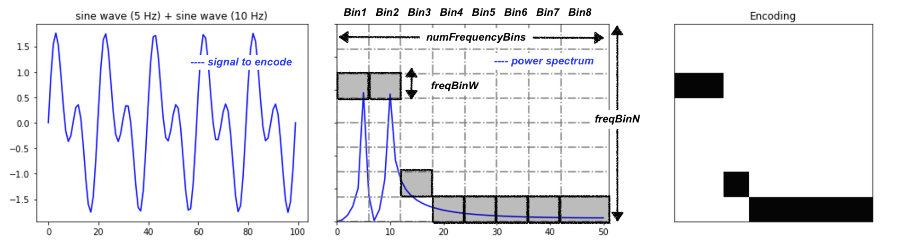
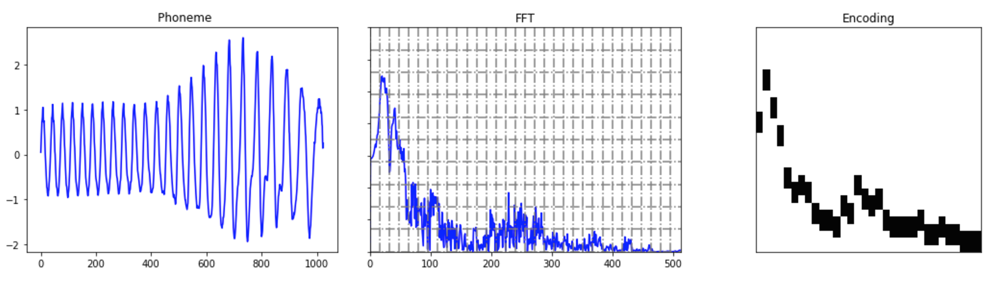

# Frequency Encoder

## Encoder design

The `FrequencyEncoder` encodes a time series chunk (or any 1D array of numeric 
values) by taking the power spectrum of the signal and discretizing it. The 
discretization is done by slicing the frequency axis of the power spectrum in
 `bins`. The parameter controlling the number of frequency bins is 
 `numFrequencyBins`. The maximum amplitude of the power spectrum in this 
 frequency bin is encoded by a `ScalarEncoder`. The parameter in 
 `FrequencyEncoder` controlling the frequency bin size is `freqBinN`, 
 which sets the parameter `n` of `ScalarEncoder`. The parameter in 
 `FrequencyEncoder` controlling the resolution (width) of a bin size is 
 `freqBinW`, which sets the parameter `w` of `ScalarEncoder`. 
 
 Here is an example with a combination of sine waves where 
 `numFrequencyBins=8`, `freqBinN=8` and `freqBinW=1` :
 
 

## Parameter tweaking
 
 To increase the resolution of the frequency encoding, increase the values
  of `numFrequencyBins` and `freqBinN`. To increase the robustness to noise 
  for each frequency bin, increase the value of `freqBinW`. Here is
   an example with a phoneme where `numFrequencyBins=32`, `freqBinN=32` and 
  `freqBinW=3`.
  



## Usage
 ```
chunk = np.array([1.0, 2.0, 1.0, 1.0])  # An example of input to encode
encoder = FrequencyEncoder(numFrequencyBins, freqBinN, freqBinW)
encoder.encode(chunk)
```

Note:
>The `FrequencyEncoder` takes 2 optional parameters as input: `minval` and 
`maxval`. These are used to set the min and max value of the `ScalarEncoder` 
used to encode the values of the the power spectrum density (PSD) in each 
`frequencyBin`. In the next section we present some analysis results where we 
show that, if you take the log of the power spectrum, the default settings 
`minval=0.0` and `maxval=14.0` work well for most sounds. Finally, there is an 
additional param in `FrequencyEncoder` which is called `log` that allows you to 
not take the log of the power spectrum. By default, `log=True` and we don't 
recommend to set it to `False` since it makes it hard to find a `maxval` value that 
works well for a variety of sounds.     


## Power spectrum analysis
Credit: [Thomas Miconi](https://github.com/ThomasMiconi)

To use `ScalarEncoder` on the power spectrum of unpredictable sound chunks, we
need an estimate of the maximum possible value that will occur in any of
these power spectra.

The exact values of the power spectrum depends on several parameters,
including the size of the time chunk and the sampling frequency. For all
phonemes used in the Phoneme data set from UCR, sampling frequency is
(roughly) 22050 Hz, so we ignore this. This leaves the question of how
max(power) varies with size of time chunk.

We simply run through several plausible values of the chunk size,
from 32 to 1024 (the phonemes all have size 1024 samples).

Perhaps unsurprisingly, the maximum value of the raw power spectrum varies grows
with time chunk size. In addition, it is badly distributed: long tail and 
high density near zero.

Both problems are solved by taking the log of the power, which is also
biologically defensible. Now max power never goes beyond 14, with a nice
bell-curve shape (not sure it's Gaussian) centered around values ranging from
6 to 10.


